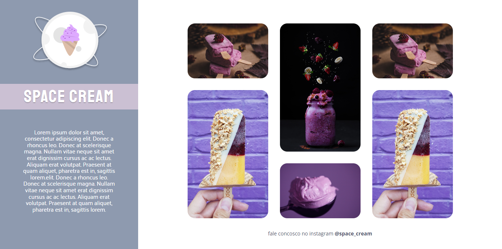

# Desafio04-Stage03

> Trilha Explorer

Projeto referente ao Desafio 04 do módulo Stage 03 do curso Explorer da RocketSeat

Foi utilizado no projeto:

- Unidade de medida flexível;
- Variáveis;
- Animações simples;
- Transições;
- Media queries;
- Grid.

## Tecnologias

- HTML
- CSS
- Git e Github

## Contato

gisellemacedo.dev@gmail.com
